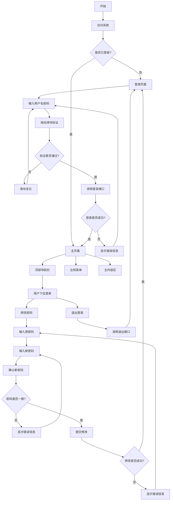

# Rainbow View 前端设计文档

## 1. 页面流程图



## 2. 技术方案

### 2.1 技术栈选型

#### 2.1.1 核心框架
- Vue 3.0
- TypeScript
- Vite (构建工具)

#### 2.1.2 UI 框架
- Element Plus
- 样式参考 RuoYi-Vue

#### 2.1.3 状态管理
- Pinia

#### 2.1.4 路由管理
- Vue Router 4.x

#### 2.1.5 HTTP 客户端
- Axios

### 2.2 项目结构

```
rainbow-view/
├── src/
│   ├── api/                # API 接口定义
│   │   ├── auth.ts        # 认证相关接口
│   │   └── user.ts        # 用户相关接口
│   ├── assets/            # 静态资源
│   ├── components/        # 公共组件
│   │   ├── SliderVerify/  # 滑块验证组件
│   │   └── Layout/        # 布局组件
│   ├── composables/       # 组合式函数
│   ├── config/           # 配置文件
│   ├── layouts/          # 布局组件
│   ├── router/           # 路由配置
│   ├── stores/           # 状态管理
│   │   ├── auth.ts       # 认证状态
│   │   └── userInfo.ts       # 用户状态
│   ├── styles/           # 全局样式
│   ├── types/            # TypeScript 类型定义
│   ├── utils/            # 工具函数
│   └── views/            # 页面组件
│       ├── login/        # 登录页面
│       └── dashboard/    # 主页面
├── public/               # 公共资源
└── package.json         # 项目依赖
```

### 2.3 核心功能实现

#### 2.3.1 登录模块

```typescript
// 登录表单接口
interface LoginForm {
  username: string;
  password: string;
}

// 滑块验证组件
interface SliderVerifyProps {
  onSuccess: () => void;
  onFail: () => void;
}

// 登录状态管理
interface AuthState {
  token: string;
  userInfo: UserInfo;
  isAuthenticated: boolean;
}
```

#### 2.3.2 主页面布局

```typescript
// 布局组件结构
interface LayoutProps {
  header: {
    welcome: string;
    userInfo: UserInfo;
  };
  menu: {
    items: MenuItem[];
    collapsed: boolean;
  };
  content: {
    breadcrumb: BreadcrumbItem[];
  };
}
```

#### 2.3.3 用户功能

```typescript
// 修改密码表单
interface ChangePasswordForm {
  oldPassword: string;
  newPassword: string;
  confirmPassword: string;
}

// 用户信息
interface UserInfo {
  userId: string;
  username: string;
  userType: string;
}
```

### 2.4 安全设计

#### 2.4.1 认证机制
- JWT Token 管理
  - Token 存储：localStorage
  - Token 刷新：自动刷新机制
  - Token 失效：自动跳转登录

#### 2.4.2 请求安全
- Axios 拦截器配置
  - 请求拦截：Token 注入
  - 响应拦截：错误处理
  - 刷新 Token：自动处理

### 2.5 性能优化

#### 2.5.1 构建优化
- 路由懒加载
- 组件按需加载
- 静态资源优化

#### 2.5.2 运行时优化
- 虚拟滚动
- 防抖节流
- 缓存策略

### 2.6 开发规范

#### 2.6.1 代码规范
- ESLint 配置
- Prettier 配置
- TypeScript 规范

#### 2.6.2 组件规范
- 组件命名规范
- Props 定义规范
- 事件命名规范

### 2.7 部署方案

#### 2.7.1 环境配置
```typescript
// 环境变量配置
interface EnvConfig {
  baseUrl: string;
  apiPrefix: string;
  timeout: number;
}
```

#### 2.7.2 构建配置
```typescript
// Vite 配置
export default defineConfig({
  base: '/',
  build: {
    outDir: 'dist',
    assetsDir: 'assets',
    sourcemap: false,
  },
  server: {
    port: 3000,
    proxy: {
      '/api': {
        target: 'http://localhost:8081',
        changeOrigin: true,
      },
    },
  },
});
```

## 3. 开发计划

### 3.1 第一阶段（1周）
- 项目初始化
- 基础框架搭建
- 登录模块开发

### 3.2 第二阶段（1周）
- 主页面布局
- 用户功能开发
- 路由配置

### 3.3 第三阶段（1周）
- 性能优化
- 测试完善
- 文档编写

## 4. 注意事项

1. 登录验证
   - 滑块验证必须完成才能提交
   - 验证失败需要重置滑块
   - 登录失败需要清空密码

2. 密码修改
   - 新密码必须与确认密码一致
   - 修改成功后需要重新登录
   - 密码强度要求提示

3. 用户体验
   - 加载状态提示
   - 错误信息友好展示
   - 操作成功反馈

4. 安全性
   - Token 安全存储
   - 敏感信息加密
   - XSS 防护 
